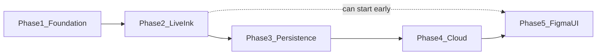

# PaperSync software plan: index

The work is five phases. Each has its own plan file with steps, tests, and a "done when" gate. The build stops for your review after each phase.

- **Phase 1: Foundation.** [01-foundation.md](01-foundation.md): move into `app/`, strict lints, pure-Dart domain, v1 protocol codec. No visible change.
- **Phase 2: Live ink.** [02-live-ink.md](02-live-ink.md): transport to codec to capture to `AppController`, simulated and BLE.
- **Phase 3: Persistence.** [03-persistence.md](03-persistence.md): encrypted local storage, crash recovery, migrations.
- **Phase 4: Cloud.** [04-cloud.md](04-cloud.md): Supabase schema, sign-in, sync.
- **Phase 5: UI from Figma.** [05-figma-ui.md](05-figma-ui.md): rebuild the screens from the [Figma design](https://www.figma.com/design/9Q4PKHBzk3oVIigtd75nLo/PaperSync?node-id=2003-129). It needs a `FIGMA_TOKEN` secret, and can start any time after Phase 2.

## Scope and base

- **In scope:** the Flutter app core and Supabase auth plus sync.
- **Out of scope:** firmware, the `spec.yaml` generator, ML Kit search, the editor command stack, and CI.
- **Branch:** `cursor/papersync-app-core-8932` from `cursor/papersync-ui-22e4` ([PR #2](https://github.com/alyastanga/PaperSync/pull/2)). The PR is stacked on it.
- **UI contract:** the screens keep using `appControllerProvider`, `AppModel`, `PenLink`, and the same public methods, so the UI can keep being sketched in parallel.
- **Layer rules** are enforced by `app/test/architecture_test.dart`:
  - `domain` and `protocol` are pure Dart.
  - `capture` may import only those two. `ble` may import only `protocol`.
  - `storage` may import only `domain`. `sync` may import `domain` and the storage interfaces.
  - Only `state/` wires them together.

## Rules every phase must meet

**Standards**
- Effective Dart style, with `dart format` clean.
- `flutter analyze` has zero issues under `strict-casts`, `strict-inference`, `strict-raw-types`, and the extra rules in Phase 1.
- Sealed classes with exhaustive `switch` for every event, state, and error. No `dynamic`.
- Immutable value types with `==` and `hashCode`.
- Only maintained packages. `pubspec.lock` is committed, and `osv-scanner` is run on it before each phase's PR update.
- One commit per logical change. Tests are green before each push.

**Security**
- No secrets in the repo. Supabase config comes from gitignored `--dart-define-from-file`, and only the anon key ships. `service_role` never appears.
- All BLE bytes are treated as untrusted:
  - The decoder is bounds-checked and never throws.
  - Size caps apply per packet, stroke, and page.
  - The app connects only to devices advertising the PaperSync service, auto-reconnects only to the pinned bonded device, and requires pairing.
- Local data is encrypted with AES-256. The key is kept in the Keychain or Keystore. Android backup is off. Web is demo-only.
- Supabase:
  - Forced RLS on every table, for the `authenticated` role only, with `using` and `with check`.
  - `anon` has no access.
  - Check constraints on every field.
  - Server-owned `updated_at`, and version decreases are refused.
  - Child rows must belong to the user's own parent rows.
  - The advisors report no findings.
- Auth uses email OTP, with the session in secure storage. Tokens, emails, and codes are never logged. Debug tools exist only under `kDebugMode`.

**Persistence**
- Stable UUID v4 ids everywhere. The current `'$prefix-$seq'` ids repeat after a restart.
- A single Hive `put` stores the record and its `syncState` flag together, so there is no separate outbox to drift out of step.
- Fixed typeIds and field indexes, pinned by a test, with versioned migrations that run before the app reads data.
- The open stroke is checkpointed every 500 ms and on app pause, and recovered exactly once.
- A corrupted box is quarantined, never deleted and never allowed to crash startup.
- Deletes are tombstones, purged 30 days after they sync.

**Robustness**
- Every async operation has a timeout. Retries use backoff with jitter and a cap. Every subscription and sink is closed on dispose.
- Errors surface as typed state, never as uncaught exceptions in the UI.
- Pushes are idempotent (client UUIDs), and the merge is a pure, fully tested function.
- Duplicate or older `seq` values are dropped, and gaps are reported.
- Tests cover every state transition, fuzz the codec, check restart, crash, migration, and corruption, and include two-user RLS checks.

## Changes from the module plan

These are deliberate, and will be recorded in `docs/` in Phase 1:

- A per-record `syncState` flag replaces the separate outbox, so a write can't be half-applied.
- Stroke points are stored as packed `bytea` of 12 bytes per point instead of `jsonb [{x,y,p,t}]`. That is about 4x smaller, with a size check.
- Email OTP replaces the magic link, so there are no deep links.
